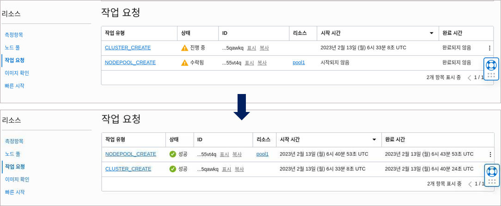

# Lab 1: Setup Cloud Environment
- OCI 콘솔 구획(Compartment) 생성 및 OKE(Oracle Kubernetes Engine) 클러스터 생성
- [LiveLabs](https://apexapps.oracle.com/pls/apex/r/dbpm/livelabs/run-workshop?p210_wid=3206&p210_wec=&session=4354810289205)에 **Lab 1: Setup Cloud Environment** 파트를 참고하시어 실습을 진행해주시기바랍니다.

## 유의사항
- 클러스터 생성 시 10~15분 정도 소요되며, 클러스터가 CREATING에서 ACTIVE 상태로 변경될 때까지 대기해주셔야합니다.
