# Get Started

## OCI 회원가입
**OKE 교육신청 시 입력했던 이메일**로 OCI 회원가입 진행 (크레딧 $600 지급)

## 1. OCI 로그인 페이지 이동
- [오라클 홈페이지](https://www.oracle.com/kr/index.html) 접속
- [계정 보기] - [클라우드에 로그인] 클릭
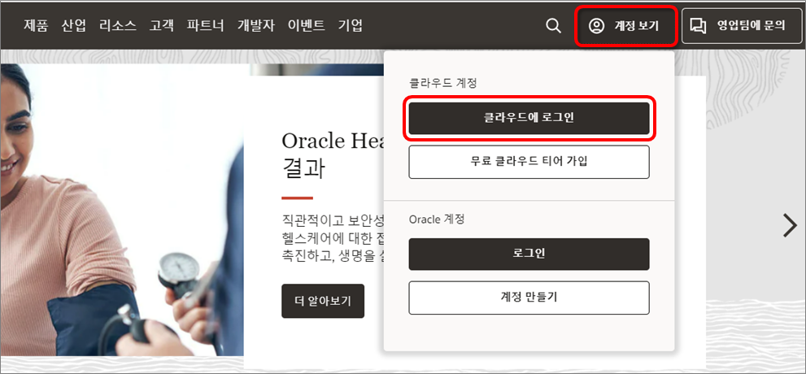

## 2. [가입하기] 클릭
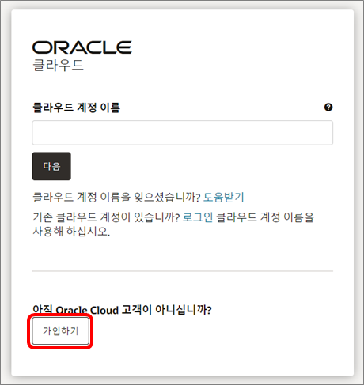

## 3. 계정 정보 입력
- 계정 정보 입력 후 , [내 전자메일 확인] 클릭
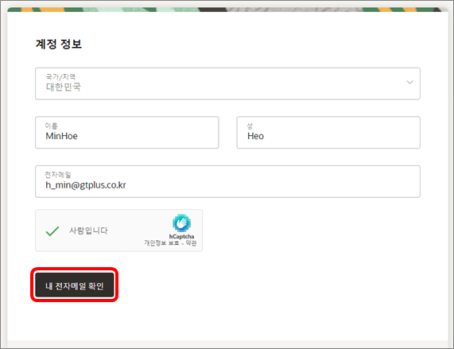
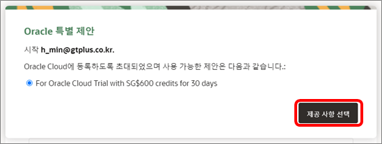

## 4. 메일 확인 링크
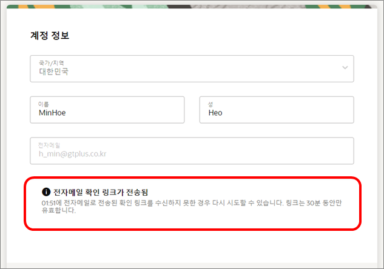
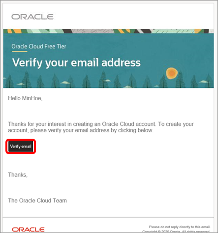

## 5. 계정 정보 입력 및 이용약관 동의
- [홈 영역] 항목은 South Korea central(Seoul) 선택 (아래 이미지 참고)
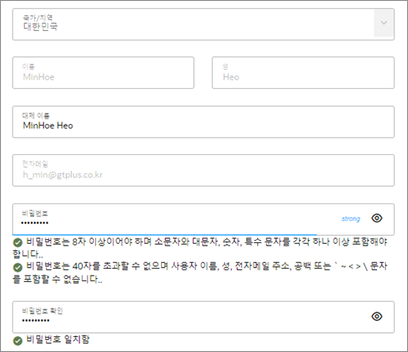
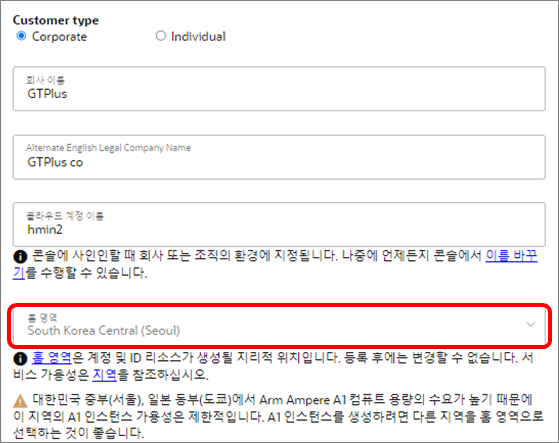
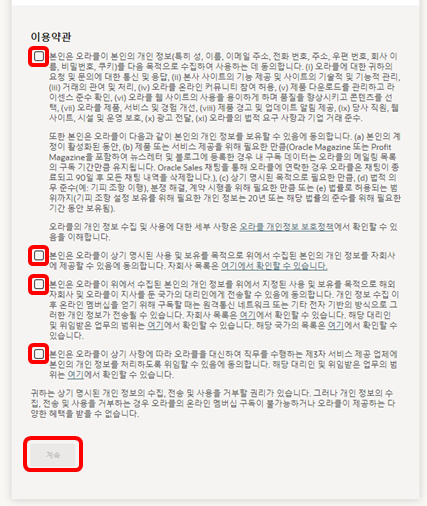

## 6. 주소 입력 및 크레딧 사용 체크
- 크레딧 사용 체크 후 [내 무료 체험판 시작하기 클릭]
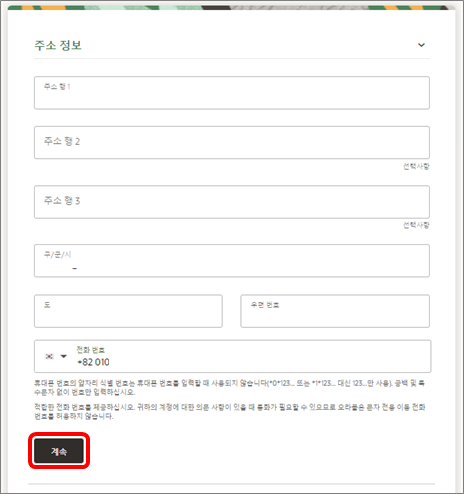
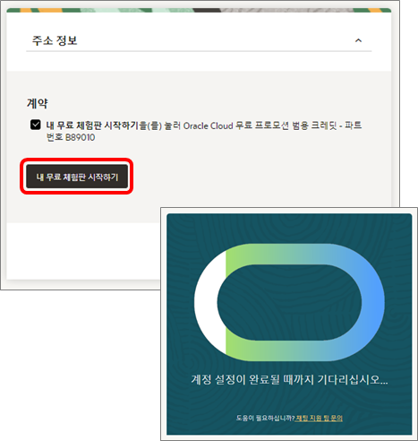

## 7. 팝업 창 해제, OCI 콘솔로 이동
- 회원가입 후 나타나는 팝업 창 [Skip], [I'll explore on my own] 클릭 후 OCI 콘솔로 이동하여 회원가입 완료
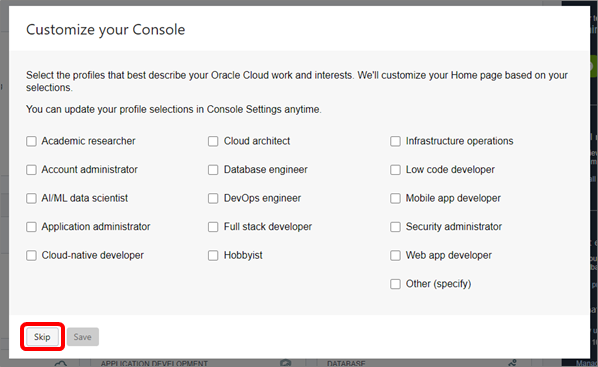