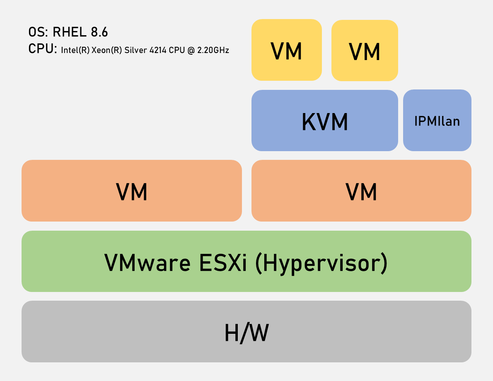

# VirtualBMC 환경 구성 on vCenter(ESXi)

# Overview



- ESXi에 VM을 생성하고(RHEL 8.6) libvirt를 설치하여 VM을 올리는 중첩된 가상화(Nested Virtualization)
- CPU는 Intel(R) Xeon(R) Silver 4214 CPU @ 2.20GHz 사용, VT 지원
- ESXi에 올린 VM에는 virtualBMC를 설치하여 KVM에서 생성한 VM의 power를 관리하도록 구성
- KVM으로 생성한 VM에 Pacemaker를 구성하고 ipmitool을 사용하여 fencing 테스트
- ESXi, KVM에 생성한 모든 VM은 RHEL 8.6
    - PACEMAKERKVM01 : KVM설치하기위한 VM으로, ESXi에서 생성한 VM (172.16.0.65)
    - PACEMAKER01 : KVM으로 생성한 VM (192.168.100.101)
    - PACEMAKER02 : KVM으로 생성한 VM (192.168.100.102)

# ESXi VM 생성 및 RHEL 설치

## VM 생성

- vCore: 4 cpu
    
    
    
    CPU 항목에 [하드웨어 가상화] - [게스트 운영 체제에 하드웨어 지원 가상화 표시] **반드시 체크**
    
- RAM: 32G
- Disk: 250GB (Thin Provisioning)
    
    

## RHEL 설치

- 설치 시 Server with GUI 확인, 아래 3개 체크 후 설치
    - Virtualization Client
    - Virtualization Hypervisor
    - Virtualization Tools
    
    
    
- RHEL 설치 후 터미널에서 Virtualization Technology 지원 여부 확인
    
    `cat /proc/cpuinfo | grep vmx` → intel CPU 기준
    
    ```bash
    [root@PACEMAKERKVM01 ~]# cat /proc/cpuinfo | grep vmx
    flags           : fpu vme de pse tsc msr pae mce cx8 apic sep mtrr pge mca cmov pat pse36 clflush mmx fxsr sse sse2 ss syscall nx pdpe1gb rdtscp lm constant_tsc arch_perfmon nopl xtopology tsc_reliable nonstop_tsc cpuid pni pclmulqdq **vmx** ssse3 fma cx16 pcid sse4_1 sse4_2 x2apic movbe popcnt tsc_deadline_timer aes xsave avx f16c rdrand hypervisor lahf_lm abm 3dnowprefetch invpcid_single ssbd ibrs ibpb stibp ibrs_enhanced tpr_shadow vnmi ept vpid ept_ad fsgsbase tsc_adjust bmi1 avx2 smep bmi2 invpcid avx512f avx512dq rdseed adx smap clflushopt clwb avx512cd avx512bw avx512vl xsaveopt xsavec xgetbv1 xsaves arat pku ospke avx512_vnni md_clear flush_l1d arch_capabilities
    ...
    ```
    
    flags가 출력이 되어야 정상, 출력되는 텍스트가 없을 경우 설정에 문제가 있거나 VT를 지원하지 않는 CPU
    
    core 갯수에 따라 같은 문구가 여러번 출력될 수 있음
    

# KVM 설치 및 구성

## KVM 설치

- 설치되지 않은 패키지가 있는지 확인 (필요할 경우 subscription 등록)
    
    `yum install qemu-kvm libvirt virt-install virt-manager`
    
    설치 화면에서 virtualization 관련 패키지를 설치했을 경우 Nothing to do 출력됨
    
- libvirtd 활성화
    
    `systemctl enable --now libvirtd`
    
    `systemctl status libvirtd`
    
    ```bash
    [root@PACEMAKERKVM01 ~]# systemctl status libvirtd
    ● libvirtd.service - Virtualization daemon
       Loaded: loaded (/usr/lib/systemd/system/libvirtd.service; enabled; vendor preset: enabled)
       Active: active (running) since Tue 2023-05-30 14:07:18 KST; 19h ago
         Docs: man:libvirtd(8)
               https://libvirt.org
     Main PID: 8317 (libvirtd)
        Tasks: 26 (limit: 32768)
       Memory: 114.2M
       CGroup: /system.slice/libvirtd.service
               ├─1981 /usr/sbin/dnsmasq --conf-file=/var/lib/libvirt/dnsmasq/default.conf --leasefile-ro --dhcp-script=/usr/libexec/libvirt_leaseshelper
               ├─1982 /usr/sbin/dnsmasq --conf-file=/var/lib/libvirt/dnsmasq/default.conf --leasefile-ro --dhcp-script=/usr/libexec/libvirt_leaseshelper
               ├─8317 /usr/sbin/libvirtd --timeout 120
               ├─8735 /usr/sbin/dnsmasq --conf-file=/var/lib/libvirt/dnsmasq/internal.conf --leasefile-ro --dhcp-script=/usr/libexec/libvirt_leaseshelper
               └─8736 /usr/sbin/dnsmasq --conf-file=/var/lib/libvirt/dnsmasq/internal.conf --leasefile-ro --dhcp-script=/usr/libexec/libvirt_leaseshelper
    ```
    
- virt-manager 명령어 입력하여 virtual machine manager 켜기
    
    `virt-manager`
    
    
    

## KVM 네트워크 구성

- 네트워크는 NAT망과 내부망 2개를 생성함, [Edit] - [Connection Details] 클릭
    
    
    
- 네트워크는 default만 있음, 내부망을 생성하기위해 좌측하단에 + 버튼 클릭
- Name은 internal, Mode는 Isolated 선택, IPv4 대역폭은 필요시 설정 (start를 100으로 수정했음)
    
    
    
    
    

## VM 생성

- Local install media 선택 후 [Forward] 클릭
    
    
    
- iso 파일 선택 후 Forward (iso 파일은 다운로드 받아서 KVM 서버에 넣어주어야함)
    
    
    
- 메모리 설정 (Memory 2G, CPU 2), 디스크 설정 (20G), 이름 설정 후 forward
    
    
    
- 생성된 VM을 더블클릭하여 새 창을 띄운 후 전구 버튼 클릭하여 VM 하드웨어 정보 전환
    
    
    
- 좌측 하드웨어 목록 우클릭 후 [Add hardware] 클릭
- Network에서 internal isolated network 클릭 후 finish
    
    
    
- 생성한 VM에 RHEL 설치 (2대)
    - NIC는 2개여야하며, internal 네트워크는 manual로 ip를 할당해주어야함

# virtualBMC 설치

- 패키지 설치
    
    `yum install python3-pip`
    
    `pip3 install -U pip`
    
    `yum install gcc python3-devel ipmitool`
    
    `pip3 install virtualbmc`
    
- vbmc 시스템 데몬 생성
    
    `vi /usr/lib/systemd/system/vbmcd.service`
    
    ```bash
    [Service]
    BlockIOAccounting = True
    CPUAccounting = True
    ExecReload = /bin/kill -HUP $MAINPID
    ExecStart = /usr/local/bin/vbmcd --foreground
    Group = root
    MemoryAccounting = True
    PrivateDevices = False
    PrivateNetwork = False
    PrivateTmp = False
    PrivateUsers = False
    Restart = on-failure
    RestartSec = 2
    Slice = vbmc.slice
    TasksAccounting = True
    TimeoutSec = 120
    Type = simple
    User = root
    
    [Unit]
    After = libvirtd.service
    After = syslog.target
    After = network.target
    Description = vbmc service
    
    [Install]
    WantedBy=multi-user.target
    ```
    
    `systemctl daemon-reload`
    
    `systemctl enable --now vbmcd`
    

- vbmc 포트 추가
    
    `vbmc add --username {username} --password {password} --port {ipmi-port} --libvirt-uri qemu:///system {VM-name}`
    
    `vbmc add --username pacemaker01 --password pacemaker01 --port 6230 --libvirt-uri qemu:///system Pacemaker01`
    
    `vbmc add --username pacemaker02 --password pacemaker02 --port 6231 --libvirt-uri qemu:///system Pacemaker02`
    
- vbmc 리스트 확인
    
    `vbmc list`
    
    ```bash
    [root@PACEMAKERKVM01 ~]# vbmc list
    +-------------+---------+---------+------+
    | Domain name | Status  | Address | Port |
    +-------------+---------+---------+------+
    | Pacemaker01 | running | ::      | 6230 |
    | Pacemaker02 | running | ::      | 6231 |
    +-------------+---------+---------+------+
    ```
    
- vbmc 상세정보 확인
    
    `vbmc show Pacemaker01`
    
    ```bash
    [root@PACEMAKERKVM01 ~]# vbmc show Pacemaker01
    +-----------------------+----------------+
    | Property              | Value          |
    +-----------------------+----------------+
    | active                | True           |
    | address               | ::             |
    | domain_name           | Pacemaker01    |
    | libvirt_sasl_password | ***            |
    | libvirt_sasl_username | None           |
    | libvirt_uri           | qemu:///system |
    | password              | ***            |
    | port                  | 6230           |
    | status                | running        |
    | username              | pacemaker01    |
    +-----------------------+----------------+
    ```
    
    이 외 비활성화(`vbmc stop {Node-name}`) 명령어가 있음
    

- vmbc를 설치하면 네트워크 브릿지(virbr1)가 하나 생성된다. (virbr0은 KVM브릿지) KVM 게스트에서는 virbr1의 아이피를 통해 ipmi를 확인할 수 있다.
    
    `ip a`
    
    ```bash
    [root@PACEMAKERKVM01 ~]# ip a
    ...
    3: virbr0: <BROADCAST,MULTICAST,UP,LOWER_UP> mtu 1500 qdisc noqueue state UP group default qlen 1000
        link/ether 52:54:00:15:a6:42 brd ff:ff:ff:ff:ff:ff
        inet 192.168.122.1/24 brd 192.168.122.255 scope global virbr0
           valid_lft forever preferred_lft forever
    4: **virbr1**: <BROADCAST,MULTICAST,UP,LOWER_UP> mtu 1500 qdisc noqueue state UP group default qlen 1000
        link/ether 52:54:00:f7:aa:4b brd ff:ff:ff:ff:ff:ff
        inet 192.168.100.1/24 brd 192.168.100.255 scope global virbr1
           valid_lft forever preferred_lft forever
    ...
    ```
    

- ipmitool로 노드 상태 확인
    
    `ipmitool -I lanplus -U pacemaker01 -P pacemaker01 -H 192.168.100.1 -p 6230 chassis status`
    
    ```bash
    [root@PACEMAKERKVM01 ~]# ipmitool -I lanplus -U pacemaker01 -P pacemaker01 -H 192.168.100.1 -p 6230 chassis status
    System Power         : on
    Power Overload       : false
    Power Interlock      : inactive
    Main Power Fault     : false
    Power Control Fault  : false
    Power Restore Policy : always-off
    Last Power Event     :
    Chassis Intrusion    : inactive
    Front-Panel Lockout  : inactive
    Drive Fault          : false
    Cooling/Fan Fault    : false
    ```
    
- 노드 시작, 종료, 재시작 테스트 명령어
    
    `ipmitool -I lanplus -U pacemaker01 -P pacemaker01 -H 172.16.0.65 -p 6230 chassis power on`
    
    `ipmitool -I lanplus -U pacemaker01 -P pacemaker01 -H 172.16.0.65 -p 6230 chassis power off`
    
    `ipmitool -I lanplus -U pacemaker01 -P pacemaker01 -H 172.16.0.65 -p 6230 chassis power reset`
    

# STONITH 생성 후 테스트

- Pacemaker 설치 과정은 생략
- 각 노드에서 `ipmitool` 명령어로 통신되는지 확인
    
    `ipmitool -I lanplus -U pacemaker01 -P pacemaker01 -H 192.168.100.1 -p 6230 chassis power on`
    
    `ipmitool -I lanplus -U pacemaker02 -P pacemaker02 -H 192.168.100.1 -p 6231 chassis power on`
    
    ```bash
    [root@PACEMAKER01 ~]# ipmitool -I lanplus -U pacemaker01 -P pacemaker01 -H 192.168.100.1 -p 6230 chassis power on
    Chassis Power Control: Up/On
    [root@PACEMAKER01 ~]# ipmitool -I lanplus -U pacemaker02 -P pacemaker02 -H 192.168.100.1 -p 6231 chassis power on
    Chassis Power Control: Up/On
    ```
    
- fence_ipmilan 생성
    
    `pcs stonith create fence_ipmilan-01 fence_ipmilan lanplus=1 username=pacemaker01 password=pacemaker01 ip=192.168.100.1 ipport=6230 pcmk_host_list="PACEMAKER01 PACEMAKER02" pcmk_delay_base=5s`
    
    `pcs stonith create fence_ipmilan-02 fence_ipmilan lanplus=1 username=pacemaker02 password=pacemaker02 ip=192.168.100.1 ipport=6231 pcmk_host_list="PACEMAKER01 PACEMAKER02"`
    
- Fencing Test
    
    PACEMAKER01# `pcs stonith fence PACEMAKER02`
    
    ```bash
    Node: PACEMAKER02 fenced
    ```
    
    PACEMAKER02# `pcs stonith fence PACEMAKER01`
    
    ```bash
    Node: PACEMAKER02 fenced
    ```